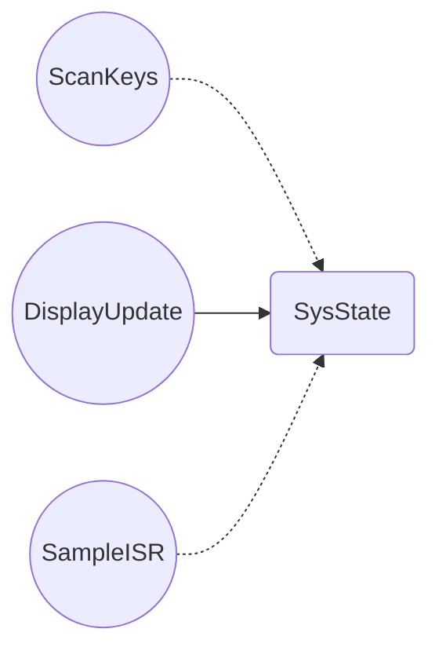

# Synth Project

This is **WeSellYourData**'s report for Embedded Systems.

## Basic Overview

Our added feature to the synthesiser board is polyphony.

## Task Implementation
**Assumptions made**
What we assumed to get these intervals and times

|       Task         |Minimum Theroetical Initiation Interval $\tau_{min}$                          |Maximum Execution Time $t_{max}$                  |
|----------------|-------------------------------|-----------------------------|
|ScanKeys|`'Isn't this fun?'`            |'Isn't this fun?'            |
|UpdateDisplay|`"Isn't this fun?"`            |"Isn't this fun?"            |
|SampleISR|`-- is en-dash, --- is em-dash`|-- is en-dash, --- is em-dash|
## Critical Instant Analysis

|       Task         |Initiation Interval $\tau$                          |Execution Time $t$                 |RMS Priority |$\lceil\frac{\tau_n}{\tau_i}\rceil$|
|----------------|-------------------------------|-----------------------------|--------|-|
|ScanKeys|`'Isn't this fun?'`            |'Isn't this fun?'            |y|n|
|UpdateDisplay|`"Isn't this fun?"`            |"Isn't this fun?"            |y|n|
|SampleISR|`-- is en-dash, --- is em-dash`|-- is en-dash, --- is em-dash|y|n|

## Total CPU Utilisation
$\color{red}{\text{TODO: Obtain this report from freeRTOS}}$
[here](https://www.freertos.org/Documentation/02-Kernel/02-Kernel-features/08-Run-time-statistics)

|       Task         |Abs Time       | % Time                  |
|----------------|-------------------------------|-----------------------------|
|ScanKeys|`'Isn't this fun?'`            |'Isn't this fun?'            |
|UpdateDisplay|`"Isn't this fun?"`            |"Isn't this fun?"            |
|SampleISR|`-- is en-dash, --- is em-dash`|-- is en-dash, --- is em-dash|
## Shared Data Structures & Synchronicity

$\color{red}{\text{TODO:Make it extremely clear with comments on firmware that we have used atomic access for thread-safe synchronisation, the clear comments will net us marks }}$
state all shared variables

|       Variable |Safe-access method used      |                
|----------------|-------------------------------|
|pahse_acumulator|atomic access          |
|CurrentNote|mutex            |
|SampleISR|`-- is en-dash, --- is em-dash`|

There should be no race conditions .

## Deadlock Analysis

Analysis of code to show if  a deadlock situation is possible
This could be a task indefinitely waiting on a mutex
[How to make recource allocation graph](https://www.youtube.com/watch?v=N0sVLZ6o9v4)
[How to make flowchart on markdown](https://mermaid.ai/open-source/syntax/flowchart.html#links-between-nodes)

## Stack allocation to tasks
$\color{red}{\text{TODO:Find stack allocated to each task }}$
|       Task         |Stack Allocated      |              
|----------------|-------------------------------|
|ScanKeys|`'Isn't this fun?'`            |
|UpdateDisplay|`"Isn't this fun?"`            |
|SampleISR|`-- is en-dash, --- is em-dash`|
