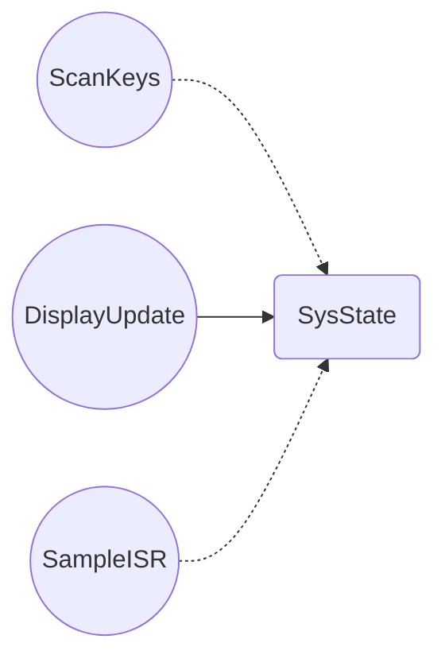
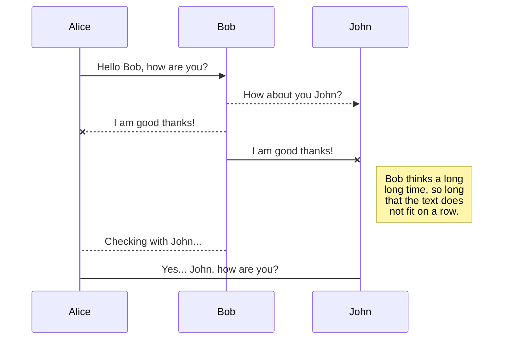

# Synth Project

This is **WeSellYourData**'s report for Embedded Systems.

## Basic Overview

Our added feature to the synthesiser board is polyphony.

## Task Implementation

theoretical minimum initiation interval (including assumptions used) and measured maximum execution time of each task

|       Task         |Minimum Theroetical Initiation Interval $\tau_{min}$                          |Maximum Execution Time $t_{max}$                  |
|----------------|-------------------------------|-----------------------------|
|ScanKeys|`'Isn't this fun?'`            |'Isn't this fun?'            |
|UpdateDisplay|`"Isn't this fun?"`            |"Isn't this fun?"            |
|SampleISR|`-- is en-dash, --- is em-dash`|-- is en-dash, --- is em-dash|
## Critical Instant Analysis

|       Task         |Initiation Interval $\tau$                          |Execution Time $t$                 |RMS Priority |$\lceil\frac{\tau_n}{\tau_i}\rceil$|
|----------------|-------------------------------|-----------------------------|--------|-|
|ScanKeys|`'Isn't this fun?'`            |'Isn't this fun?'            |y|n|
|UpdateDisplay|`"Isn't this fun?"`            |"Isn't this fun?"            |y|n|
|SampleISR|`-- is en-dash, --- is em-dash`|-- is en-dash, --- is em-dash|y|n|

## Total CPU Utilisation
[TODO: Obtain this report from freeRTOS](https://www.freertos.org/Documentation/02-Kernel/02-Kernel-features/08-Run-time-statistics)

|       Task         |Abs Time       | % Time                  |
|----------------|-------------------------------|-----------------------------|
|ScanKeys|`'Isn't this fun?'`            |'Isn't this fun?'            |
|UpdateDisplay|`"Isn't this fun?"`            |"Isn't this fun?"            |
|SampleISR|`-- is en-dash, --- is em-dash`|-- is en-dash, --- is em-dash|
## Shared Data Structures & Synchronicity

$\color{red}{\text{Make it extremely clear with comments on firmware that we have used atomic access for thread-safe synchronisation, the clear comments will net us marks }}$
state all shared variables
How have we guaranteed safe access to shared variables: atomicity, mutexes, 
There should be no race conditions .

## Deadlock Analysis

Analysis of code to show if  a deadlock situation is possible
This could be a task indefinitely waiting on a mutex
[How to make recource allocation graph](https://www.youtube.com/watch?v=N0sVLZ6o9v4)
[How to make flowchart on markdown](https://mermaid.ai/open-source/syntax/flowchart.html#links-between-nodes)

# How to write in markdown

*Italic*
**Bold**
> How to do this

Table example:

## KaTeX

You can render LaTeX mathematical expressions using [KaTeX](https://khan.github.io/KaTeX/):

The *Gamma function* satisfying $\Gamma(n) = (n-1)!\quad\forall n\in\mathbb N$ is via the Euler integral

$$
\Gamma(z) = \int_0^\infty t^{z-1}e^{-t}dt\,.
$$

## UML diagrams

You can render UML diagrams using [Mermaid](https://mermaidjs.github.io/). For example, this will produce a sequence diagram:

And this will produce a flow chart:

