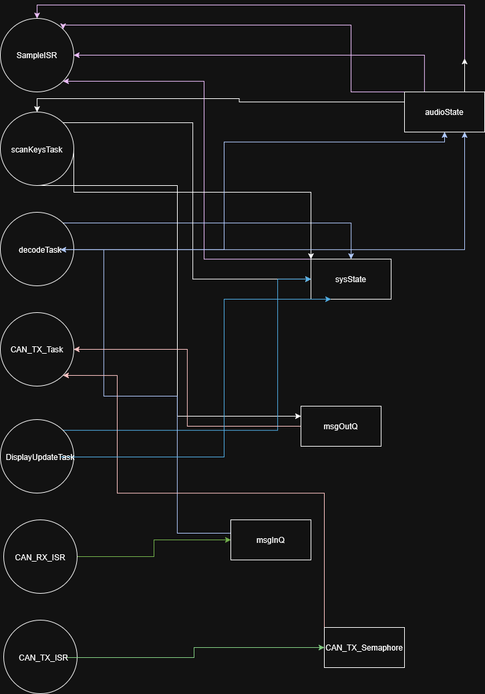
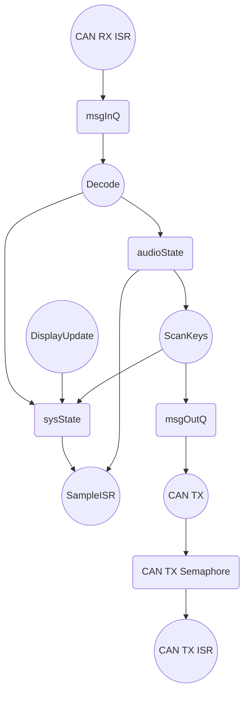

# Synth Project

This is **WeSellYourData**'s report for Embedded Systems.

## Basic Overview 

Our added feature to the synthesiser board is 24-note polyphony. Our firmware improves how smooth notes sound by taking the sawtooth wave and converting it into a triangular wave. Switching between sawtooth and triangle wave can be easily configured.

## Demo Video 

https://github.com/user-attachments/assets/2c86b4a1-4571-4c39-a189-eb069c5ad8af

## What our tasks do

***Scankeys***

Runs every 20ms. Scans 4×4 matrix, computes stable 12-bit key mask with two-scan debounce, updates knob3 state, writes localMask atomically, sends 'M' bitmask CAN message to msgOutQ.

***DisplayUpdate***

Runs every 100ms. Reads inputs, rxMsg, masks, and knob3Rotation under mutex. Renders note names, volume, octave, and mask values to 128×32 OLED via U8g2.

***Decode***

Blocked on msgInQ. On 'M' message, reconstructs 12-bit remote mask from bytes 2–3, computes octave-shifted step frequencies, writes atomically to remoteFreqs and remoteMask.

***CAN_TX***

Blocked on msgOutQ. Dequeues a message, takes CAN_TX_Semaphore to prevent buffer overflow, transmits via CAN_TX().

***Sample ISR***

Triggered by TIM1 at 22kHz. Reads local/remote masks atomically, advances phase accumulators, computes triangle wave samples, mixes and normalises by voice count, scales by knob3Rotation, outputs via analogWrite.

***CAN_RX_ISR***

On CAN frame receipt, reads frame via CAN_RX() and posts to msgInQ via xQueueSendFromISR.

***CAN_TX_ISR***

On transmission acknowledgment, gives CAN_TX_Semaphore via xSemaphoreGiveFromISR to unblock CAN_TX_Task.

## Our Definitions of Worst Case Situations

***Scankeys***

 -   All 12 keys pressed simultaneously
    
-   knob rotating
    
-   12 CAN messages queued
    
-   Full mutex locking/unlocking
    
-   All bitmask calculations for polyphony

***DisplayUpdate***
-   Maximum values for all displayed data

-   key12 = 0xFFF (3 hex characters to render)
    
-   selectedKey = 999 (3 digits)
    
-   vol = 8, lMask = 0xFFF, rMask = 0xFFF
    
-   CAN message = "P255255" (longest possible string)
    
-   Full U8g2 display buffer clear, font loading, and rendering
    
-   All text printed at maximum length
    
-   SendBuffer to push entire frame to OLED

***Decode***
-   Queue pre-filled with messages (xQueueReceive executes but doesn't block)
    
-   Message type = 'P' (requires full octave shift calculation vs 'R')
    
-   Octave = 7 (shift by +3 from base, forces maximum shift operations)
    
-   Note = 11 (highest note index, ensures all code paths)
    
-   xQueueReceive operation (fetches message from queue)
    
-   Mutex lock/unlock to copy 8-byte message
    
-   Calculate octave shift: freq << 3 (multiply by 8)
    
-   Atomic write of octave-shifted frequency
    
-   Atomic update of remote active mask

***CAN_TX***
-   Queue pre-filled with messages (xQueueReceive executes but doesn't block)
    
-   Semaphore pre-filled with permits (xSemaphoreTake executes but doesn't block)
    
-   Message ready: 'P', octave 4, note 11
    
-   Full CAN_TX() hardware transmission
    
-   CAN peripheral writes to registers, formats message, transmits bits over bus
    
-   Waits for CAN acknowledgment from other nodes
What we assumed to get these intervals and times

## Critical Instant Analysis

|       Task         |Minimum Theroetical Initiation Interval $\tau_{i}$                          |Maximum Execution Time $T_{i}$            |RMS Priority |$\lceil\frac{\tau_n}{\tau_i}\rceil$|$\lceil\frac{\tau_n}{\tau_i}\rceil T_{i}$|
|----------------|-------------------------------|-----------------------------|--------|-|-|
|SampleISR   |0.04545ms    |31.71µs|High|2201|69.79371ms|
|ScanKeys       |20ms          | 57.3µs|3|5|286.5µs|
|Decode     |2.8ms           |15µs|2|36|540µs|
|CAN_TX   |80ms        |235.5µs|2|2|471µs|
|DisplayUpdate     |100ms             |18.05ms|1|1|18.05ms|

The lowest priority task with the longest initiation interval is DisplayUpdate with $\tau_n = 100ms$.

$$Total Latency = 89.14121ms$$

$$89.14121ms < 100ms$$

Total latency is less than the initation interval of "lowest priority task" so the critical instanst analysis passes. 

## Total CPU Utilisation

|       Task         | % Time                  |
|----------------|-----------------------------|
|ScanKeys       |0.29           |
|DisplayUpdate    |18.05             |
|Decode     |2.14             |
|CAN_TX   |1.18         |
|SampleISR   |69.8     |

## Shared Data Structures & Synchronicity

state all shared variables

|       Variable |Safe-access method used      |                
|----------------|-------------------------------|
|inputs (32-bit)|mutex         |
|knob3Rotation|atomic          |
|rxMSG| mutex|
|localMask| atomic|
|remoteMask| atomic|
|remoteFreqs| atomic|

There should be no race conditions .

## Deadlock Analysis

Analysis of code to show if  a deadlock situation is possible
This could be a task indefinitely waiting on a mutex
[How to make recource allocation graph](https://www.youtube.com/watch?v=N0sVLZ6o9v4)
[How to make flowchart on markdown](https://mermaid.ai/open-source/syntax/flowchart.html#links-between-nodes)

## Stack Allocation

|       Task         |Stack Allocated Under Normal Operation    |     Stack Allocated With Safety Margin    |          
|----------------|-------------------------|---------------|
|ScanKeys|60         |128|
|DisplayUpdate|112      |180   |
|Decode|55|128|
|CAN_TX|61|128|

To start with all stack sizes were set to 256 and then stack sizes for each task were checked individually.
With the initial stack of 256, we looked at how much stack was remaining to get an idea of how much stack was used in run-time. 
