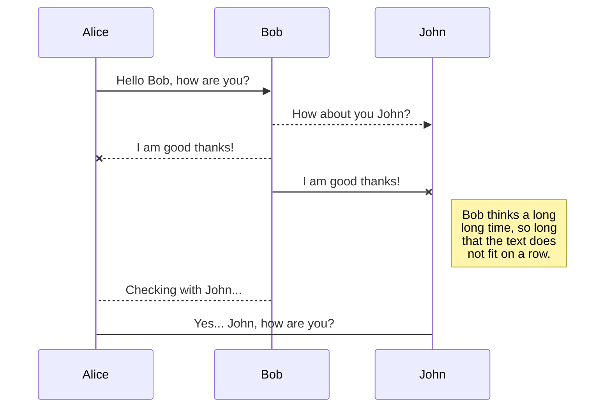
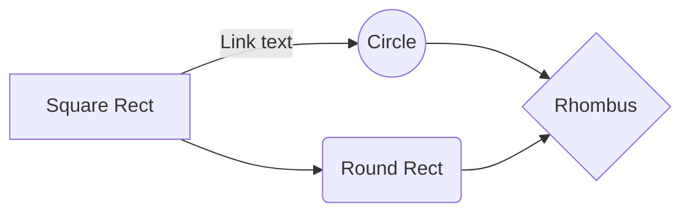

# Synth Project

This is **WeSellYourData**'s report for Embedded Systems.

## Basic Overview

Our added feature to the synthesiser board is...

## Demo Video

## Task Implementation

theoretical minimum initiation interval (including assumptions used) and measured maximum execution time of each task

## Critical Instant Analysis

showing that all deadlines are met under worst-case conditions

## Total CPU Utilisation

## Shared Data Structures & Synchronicity

state all shared variables
How have we guaranteed safe access to shared variables

## Deadlock Analysis

Analysis of code to show if  a deadlock situation is possible

# How to write in markdown

*Italic*
**Bold**
> How to do this

Table example:

|                |ASCII                          |HTML                         |
|----------------|-------------------------------|-----------------------------|
|Single backticks|`'Isn't this fun?'`            |'Isn't this fun?'            |
|Quotes          |`"Isn't this fun?"`            |"Isn't this fun?"            |
|Dashes          |`-- is en-dash, --- is em-dash`|-- is en-dash, --- is em-dash|

## KaTeX

You can render LaTeX mathematical expressions using [KaTeX](https://khan.github.io/KaTeX/):

The *Gamma function* satisfying $\Gamma(n) = (n-1)!\quad\forall n\in\mathbb N$ is via the Euler integral

$$
\Gamma(z) = \int_0^\infty t^{z-1}e^{-t}dt\,.
$$

## UML diagrams

You can render UML diagrams using [Mermaid](https://mermaidjs.github.io/). For example, this will produce a sequence diagram:

And this will produce a flow chart:

