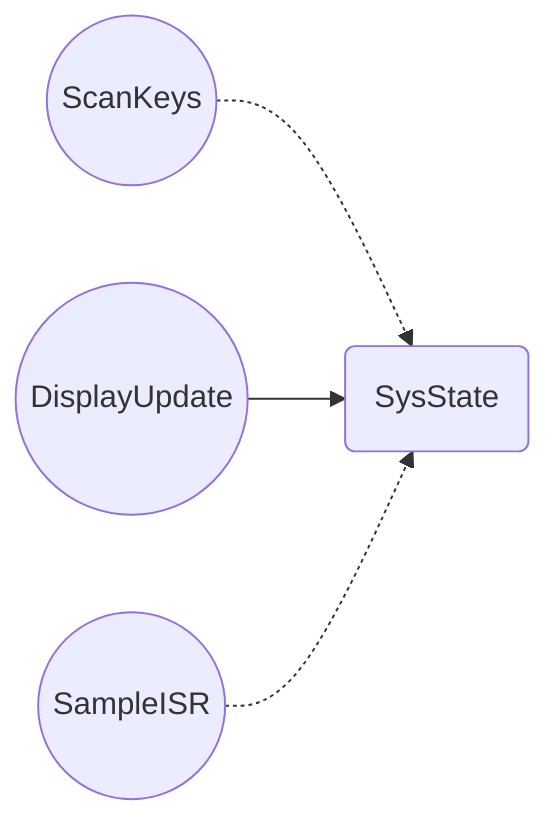

# Synth Project

This is **WeSellYourData**'s report for Embedded Systems.

## Basic Overview

Our added feature to the synthesiser board is 24-note polyphony. Our firmware improves how smooth notes sound by taking the sawtooth wave and converting it into a triangular wave. Switching between sawtooth and triangle wave can be easily configured.

## Our Definitions of Worst Case Situations

***Scankeys***

 -   All 12 keys pressed simultaneously
    
-   knob rotating
    
-   12 CAN messages queued
    
-   Full mutex locking/unlocking
    
-   All bitmask calculations for polyphony

***DisplayUpdate***
-   Maximum values for all displayed data

-   key12 = 0xFFF (3 hex characters to render)
    
-   selectedKey = 999 (3 digits)
    
-   vol = 8, lMask = 0xFFF, rMask = 0xFFF
    
-   CAN message = "P255255" (longest possible string)
    
-   Full U8g2 display buffer clear, font loading, and rendering
    
-   All text printed at maximum length
    
-   SendBuffer to push entire frame to OLED

***Decode***
-   Queue pre-filled with messages (xQueueReceive executes but doesn't block)
    
-   Message type = 'P' (requires full octave shift calculation vs 'R')
    
-   Octave = 7 (shift by +3 from base, forces maximum shift operations)
    
-   Note = 11 (highest note index, ensures all code paths)
    
-   xQueueReceive operation (fetches message from queue)
    
-   Mutex lock/unlock to copy 8-byte message
    
-   Calculate octave shift: freq << 3 (multiply by 8)
    
-   Atomic write of octave-shifted frequency
    
-   Atomic update of remote active mask

***CAN_TX***
-   Queue pre-filled with messages (xQueueReceive executes but doesn't block)
    
-   Semaphore pre-filled with permits (xSemaphoreTake executes but doesn't block)
    
-   Message ready: 'P', octave 4, note 11
    
-   Full CAN_TX() hardware transmission
    
-   CAN peripheral writes to registers, formats message, transmits bits over bus
    
-   Waits for CAN acknowledgment from other nodes
What we assumed to get these intervals and times

## Critical Instant Analysis

|       Task         |Minimum Theroetical Initiation Interval $\tau_{min}$                          |Maximum Execution Time $t_{max}$            |RMS Priority |$\lceil\frac{\tau_n}{\tau_i}\rceil$|
|----------------|-------------------------------|-----------------------------|--------|-|
|ScanKeys|`'Isn't this fun?'`            |'Isn't this fun?'            |y|n|
|UpdateDisplay|`"Isn't this fun?"`            |"Isn't this fun?"            |y|n|
|SampleISR|`-- is en-dash, --- is em-dash`|-- is en-dash, --- is em-dash|y|n|

## Total CPU Utilisation

|       Task         |Abs Time       | % Time                  |
|----------------|-------------------------------|-----------------------------|
|ScanKeys|`'Isn't this fun?'`            |'Isn't this fun?'            |
|UpdateDisplay|`"Isn't this fun?"`            |"Isn't this fun?"            |
|SampleISR|`-- is en-dash, --- is em-dash`|-- is en-dash, --- is em-dash|
## Shared Data Structures & Synchronicity

$\color{red}{\text{TODO:Make it extremely clear with comments on firmware that we have used atomic access for thread-safe synchronisation, the clear comments will net us marks }}$
state all shared variables

|       Variable |Safe-access method used      |                
|----------------|-------------------------------|
|pahse_acumulator|atomic access          |
|CurrentNote|mutex            |
|SampleISR|`-- is en-dash, --- is em-dash`|

There should be no race conditions .

## Deadlock Analysis

Analysis of code to show if  a deadlock situation is possible
This could be a task indefinitely waiting on a mutex
[How to make recource allocation graph](https://www.youtube.com/watch?v=N0sVLZ6o9v4)
[How to make flowchart on markdown](https://mermaid.ai/open-source/syntax/flowchart.html#links-between-nodes)

## Stack Allocation

|       Task         |Stack Allocated Under Normal Operation    |     Stack Allocated With Safety Margin    |          
|----------------|-------------------------|---------------|
|ScanKeys|60         |128|
|DisplayUpdate|112      |180   |
|Decode|55|128|
|CAN_TX|61|128|
To start with all stack sizes were set to 256 and then stack sizes for each task were checked individually.
With the initial stack of 256, we looked at how much stack was remaining to get an idea of how much stack was used in run-time. 
